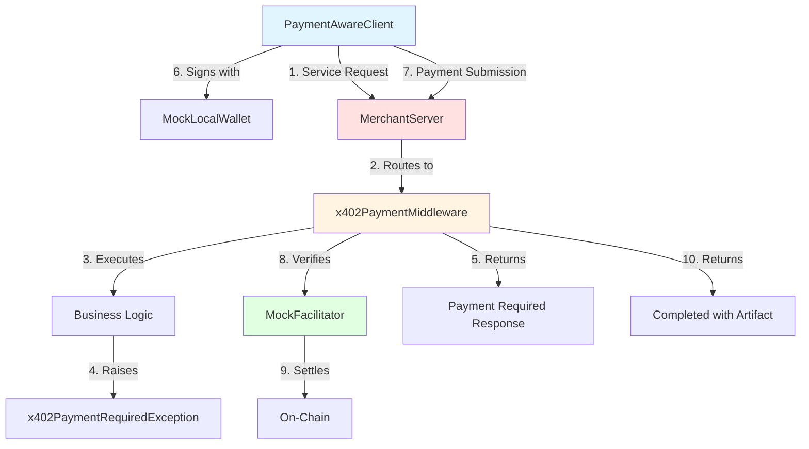
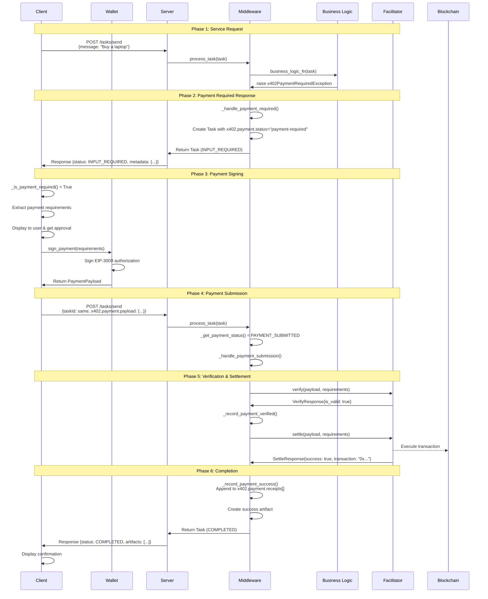
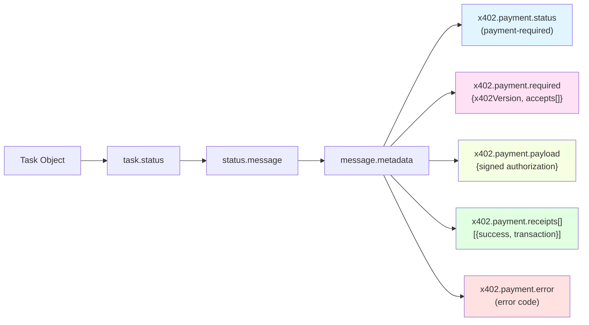
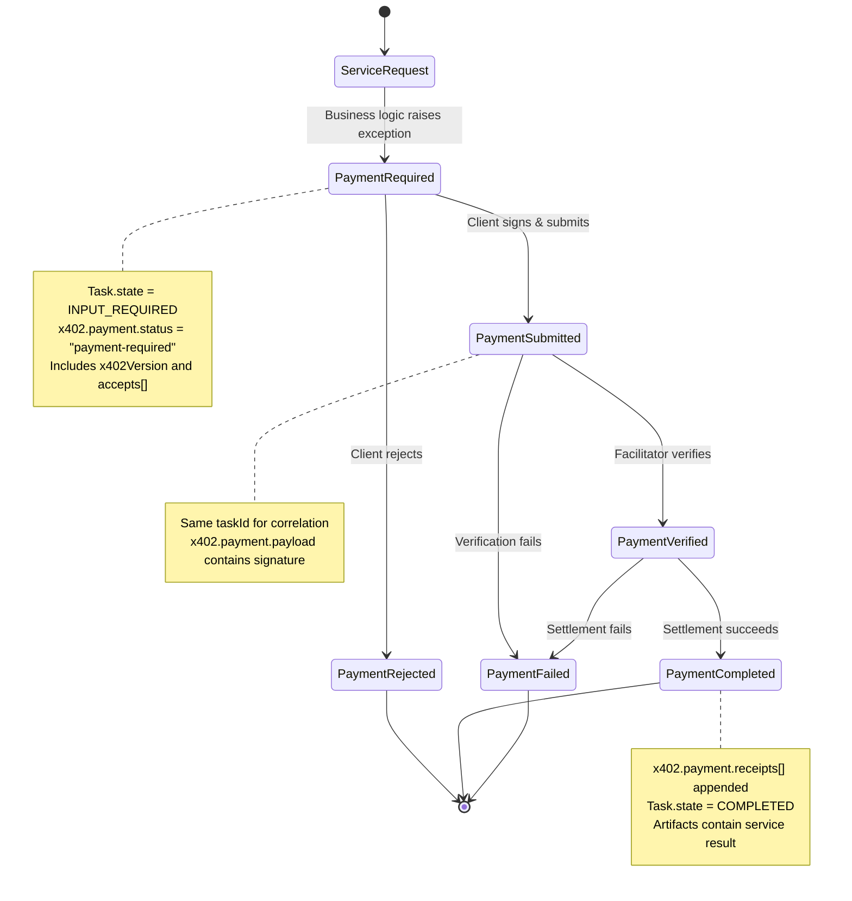
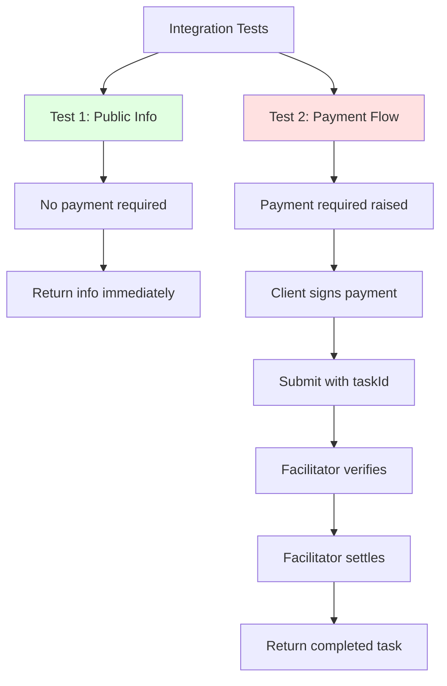

# Architecture Documentation

This document provides a comprehensive overview of the python-a2a-x402 implementation architecture, payment flow, and component interactions.

## System Overview

The python-a2a-x402 implements the x402 Payments Extension for the A2A (Agent-to-Agent) protocol, enabling cryptocurrency payments for agent services using the python-a2a framework.

### Core Components



### Component Responsibilities

| Component | Responsibility | Location |
|-----------|---------------|----------|
| **PaymentAwareClient** | Orchestrates payment flow from client side | `src/payment_client.py` |
| **MockLocalWallet** | Signs EIP-3009 payment authorizations | `src/wallet.py` |
| **MerchantServer** | Extends A2AServer with payment-required services | `src/merchant_server.py` |
| **x402PaymentMiddleware** | Handles payment verification and settlement | `src/x402_middleware.py` |
| **MockFacilitator** | Simulates on-chain payment verification | `src/facilitator.py` |

## Payment Flow Sequence

This diagram shows the complete end-to-end payment flow for a single purchase transaction.



## Metadata Structure

The implementation uses spec-compliant `x402.payment.*` dotted keys in `task.status.message.metadata`:



### Metadata Keys

| Key | Phase | Type | Description |
|-----|-------|------|-------------|
| `x402.payment.status` | All | string | Current payment state (kebab-case) |
| `x402.payment.required` | Payment Required | object | Contains `x402Version` and `accepts` array |
| `x402.payment.payload` | Payment Submitted | object | Signed payment authorization |
| `x402.payment.receipts` | Completed/Failed | array | Complete history of settlement attempts |
| `x402.payment.error` | Failed | string | Standardized error code |

## State Machine

The payment flow follows a well-defined state machine:



## Function Call Trace: Complete Purchase Example

This section traces a complete purchase through the system with actual data types and return values.

### Example: "Buy a laptop" Request

#### 1. Client Initiates Request

**Function**: `PaymentAwareClient.ask()`
```python
# Input
message_text = "Buy a laptop"
auto_approve = True

# Creates Task
task = Task(
    id="9aeac688-5c13-41cf-9094-d26c62c1ad37",
    message={
        "content": {"text": "Buy a laptop"},
        "role": "user"
    }
)

# Sends to server
result_task = client._send_task(task)
```

#### 2. Server Handles Task

**Function**: `MerchantServer.handle_task()`
```python
# Input: task from step 1

# Extracts message
message_text = "Buy a laptop"  # via _extract_message_text()

# Checks if buy request
is_buy = True  # via _is_buy_request()

# Routes to buy handler
_handle_buy_request(task, message_text)
```

#### 3. Business Logic Raises Payment Exception

**Function**: `MerchantServer._handle_buy_request()`
```python
# Extract product
product_name = "laptop"  # via _extract_product_name()

# Calculate price
price = 87202425  # via _calculate_price() - deterministic hash

# Create requirements
requirements = PaymentRequirements(
    scheme="exact",
    network="base-sepolia",
    asset="0x036CbD53842c5426634e7929541eC2318f3dCF7e",
    pay_to="0xAb5801a7D398351b8bE11C439e05C5B3259aeC9B",
    max_amount_required="87202425",
    description="Payment for: laptop",
    resource="https://merchant.example.com/products/laptop",
    mime_type="application/json",
    max_timeout_seconds=1200,
    output_schema={
        "type": "object",
        "properties": {
            "order_id": {"type": "string"},
            "product": {"type": "string"},
            "price": {"type": "number"},
            "confirmation": {"type": "string"}
        }
    },
    extra={
        "version": "1.0",
        "name": "USDC",
        "decimals": 6,
        "product": {"name": "laptop", "sku": "laptop_sku", "price": 87202425}
    }
)

# Raise exception (caught by middleware)
raise x402PaymentRequiredException(
    "Payment required for laptop",
    payment_requirements=requirements
)
```

#### 4. Middleware Handles Payment Required

**Function**: `x402PaymentMiddleware._handle_payment_required()`
```python
# Input
task.id = "9aeac688-5c13-41cf-9094-d26c62c1ad37"
exception.payment_requirements = [requirements]  # from step 3

# Store requirements
self.payment_store[task.id] = exception.payment_requirements

# Update task
task.status = TaskStatus(state=TaskState.INPUT_REQUIRED)
task.status.message = Message(
    content=TextContent(text="Payment required for laptop"),
    role=MessageRole.AGENT,
    metadata=Metadata(
        custom_fields={
            "x402.payment.status": "payment-required",
            "x402.payment.required": {
                "x402Version": 1,
                "accepts": [{
                    "scheme": "exact",
                    "network": "base-sepolia",
                    "asset": "0x036CbD53842c5426634e7929541eC2318f3dCF7e",
                    "payTo": "0xAb5801a7D398351b8bE11C439e05C5B3259aeC9B",
                    "maxAmountRequired": "87202425",
                    "description": "Payment for: laptop",
                    # ... full requirements
                }]
            }
        }
    )
)

# Return
return task  # With INPUT_REQUIRED status
```

#### 5. Client Detects Payment Required

**Function**: `PaymentAwareClient._is_payment_required()`
```python
# Input: result_task from step 4

# Check state
result_task.status.state == TaskState.INPUT_REQUIRED  # True

# Extract metadata
metadata = result_task.status.message.metadata.custom_fields
status = metadata["x402.payment.status"]  # "payment-required"

# Return
return True  # Payment is required
```

#### 6. Client Signs Payment

**Function**: `MockLocalWallet.sign_payment()`
```python
# Input
x402_response = x402PaymentRequiredResponse(
    x402_version="1",
    accepts=[requirements],  # from step 4
    error="payment_required"
)

# Extract first requirement
requirement = x402_response.accepts[0]

# Create EIP-3009 authorization
authorization = EIP3009Authorization(
    from_address=self.address,  # "0x7E5F4552091A69125d5DfCb7b8C2659029395Bdf"
    to_address=requirement.pay_to,
    value=requirement.max_amount_required,
    valid_after=0,
    valid_before=2**256 - 1,
    nonce=bytes(32)  # Random nonce
)

# Sign
signature = self.account.sign_message(authorization.encode_eip712())

# Create payload
payload = PaymentPayload(
    x402_version=1,
    network="base-sepolia",
    scheme="exact",
    payload=ExactPaymentPayload(
        authorization=authorization,
        signature=signature.signature.hex()
    )
)

# Return
return payload
```

#### 7. Client Submits Payment

**Function**: `PaymentAwareClient._handle_payment_flow()` (continued)
```python
# Create payment submission
payment_message = Message(
    content=TextContent(text="Payment authorization provided"),
    role=MessageRole.USER,
    metadata=Metadata(
        custom_fields={
            "x402.payment.status": "payment-submitted",
            "x402.payment.payload": payload.model_dump(by_alias=True)
        }
    )
)

payment_task = Task(
    id=task.id,  # SAME ID for correlation!
    status=TaskStatus(
        state=TaskState.INPUT_REQUIRED,
        message=payment_message.to_dict()
    )
)

# Submit
result_task = self.client._send_task(payment_task)
```

#### 8. Middleware Processes Payment

**Function**: `x402PaymentMiddleware._handle_payment_submission()`
```python
# Extract payload
payload = _get_payment_payload(task)  # PaymentPayload from step 6

# Get stored requirements
requirements_list = self.payment_store[task.id]  # From step 4

# Find match
requirements = _find_matching_requirement(requirements_list, payload)

# Validate expiry
is_valid = _validate_payment_expiry(requirements)  # True

# Verify
verify_response = self.facilitator.verify(payload, requirements)
# Returns: VerifyResponse(is_valid=True, invalid_reason=None)

# Record verification
_record_payment_verified(task)
# Sets: metadata["x402.payment.status"] = "payment-verified"

# Settle
settle_response = self.facilitator.settle(payload, requirements)
# Returns: SettleResponse(
#     success=True,
#     transaction="0x1234...",
#     network="base-sepolia",
#     payer="0x7E5F4552091A69125d5DfCb7b8C2659029395Bdf"
# )

# Record success
_record_payment_success(task, settle_response)
# Appends to: metadata["x402.payment.receipts"] = [settle_response]
# Sets: metadata["x402.payment.status"] = "payment-completed"

# CRITICAL: Preserve message when updating status
result_task = task
result_task.status = TaskStatus(
    state=TaskState.COMPLETED,
    message=task.status.message  # Preserve payment metadata
)

# Create artifact
result_task.artifacts = [{
    "parts": [{
        "type": "text",
        "text": "✅ Payment verified and order confirmed!\n\n" +
                "You have successfully purchased: laptop\n\n" +
                "Thank you for your business!"
    }]
}]

# Return
return result_task
```

#### 9. Client Receives Confirmation

**Function**: `PaymentAwareClient._is_payment_completed()`
```python
# Input: result_task from step 8

# Extract custom_fields from metadata using helper
metadata = _extract_custom_fields(result_task.status.message)

# Check payment status
status = metadata.get("x402.payment.status")  # "payment-completed"

# Get receipts
receipts = metadata.get("x402.payment.receipts", [])
# [{"success": true, "transaction": "0x1234...", "network": "base-sepolia"}]

# Return
return status == PaymentStatus.PAYMENT_COMPLETED.value  # True
```

## Error Handling

The system uses standardized error codes per spec Section 8.1:

```mermaid
graph TD
    Error[Payment Error Occurs]
    Classify{Classify Error}

    Error --> Classify

    Classify -->|Missing funds| INSUFFICIENT_FUNDS
    Classify -->|Bad signature| INVALID_SIGNATURE
    Classify -->|Timeout exceeded| EXPIRED_PAYMENT
    Classify -->|Nonce reused| DUPLICATE_NONCE
    Classify -->|Wrong chain| NETWORK_MISMATCH
    Classify -->|Wrong amount| INVALID_AMOUNT
    Classify -->|On-chain failure| SETTLEMENT_FAILED

    INSUFFICIENT_FUNDS --> Record[_record_payment_failure]
    INVALID_SIGNATURE --> Record
    EXPIRED_PAYMENT --> Record
    DUPLICATE_NONCE --> Record
    NETWORK_MISMATCH --> Record
    INVALID_AMOUNT --> Record
    SETTLEMENT_FAILED --> Record

    Record --> Metadata[Set x402.payment.error]
    Record --> Receipt[Append to receipts[]]
    Record --> TaskState[Set Task.state=FAILED]

    style INSUFFICIENT_FUNDS fill:#ffe1e1
    style INVALID_SIGNATURE fill:#ffe1e1
    style EXPIRED_PAYMENT fill:#ffe1e1
    style SETTLEMENT_FAILED fill:#ffe1e1
```

### Error Code Usage

```python
# In middleware
try:
    verify_response = self.facilitator.verify(payload, requirements)
    if not verify_response.is_valid:
        return self._fail_payment(
            task,
            x402ErrorCode.INVALID_SIGNATURE,  # Enum value
            verify_response.invalid_reason
        )
except Exception as e:
    return self._fail_payment(
        task,
        x402ErrorCode.SETTLEMENT_FAILED,
        f"Verification failed: {e}"
    )

# Error recorded in metadata
metadata["x402.payment.error"] = "INVALID_SIGNATURE"  # String value
```

## Key Design Decisions

### 1. Middleware Pattern

We use a separate `x402PaymentMiddleware` class rather than inline payment logic:

**Benefits**:
- Clean separation of concerns
- Reusable across different server implementations
- Testable in isolation
- Easy to swap facilitator implementations

### 2. Task ID Correlation

Payment submissions reuse the original task ID for correlation:

```python
# Original request
task.id = "9aeac688-5c13-41cf-9094-d26c62c1ad37"

# Payment submission (SAME ID)
payment_task.id = "9aeac688-5c13-41cf-9094-d26c62c1ad37"
```

This allows the middleware to:
- Retrieve stored payment requirements
- Link payment to correct service request
- Maintain conversation context

### 3. Metadata Handling

We use a helper function to handle both dict and Metadata object formats:

```python
def _get_metadata_dict(message) -> dict:
    """Extract metadata as dict from Message object."""
    if isinstance(message, dict):
        metadata = message.get('metadata', {})
        return metadata.get('custom_fields', metadata)

    if hasattr(message.metadata, 'custom_fields'):
        return message.metadata.custom_fields

    return {}
```

This provides compatibility across python-a2a's different serialization formats.

### 4. Receipt Array

All payment attempts (success or failure) are appended to the `x402.payment.receipts` array:

```python
# Success
receipts = [
    {"success": true, "transaction": "0x1234...", "network": "base-sepolia"}
]

# Multiple attempts
receipts = [
    {"success": false, "errorReason": "insufficient funds"},
    {"success": true, "transaction": "0x5678...", "network": "base-sepolia"}
]
```

This maintains complete payment history per spec requirement.

## Testing Strategy



See `tests/test_integration.py` for complete test implementation.

## Production Considerations

### Security

1. **Private Key Management**: MockLocalWallet is for testing only. Production should use:
   - Hardware wallets
   - Key management services (AWS KMS, HashiCorp Vault)
   - Never store private keys in code

2. **Payment Validation**: Production facilitators should:
   - Verify signatures cryptographically
   - Check nonce uniqueness (prevent replay)
   - Validate amounts and recipients
   - Confirm on-chain settlement

3. **Network Security**: All communication should use:
   - TLS/HTTPS for transport
   - Request authentication
   - Rate limiting
   - CORS restrictions

### Scalability

1. **Payment Store**: Current in-memory dict should be replaced with:
   - Redis for multi-process deployments
   - Database for persistence
   - TTL for automatic cleanup

2. **Async Operations**: python-a2a supports async; facilitator operations should be:
   - Non-blocking
   - Queued for high throughput
   - Retryable on failure

3. **Caching**: Consider caching:
   - AgentCard responses
   - Payment requirement templates
   - Facilitator configurations

## References

- **x402 A2A Extension**: https://github.com/google-agentic-commerce/a2a-x402
- **x402 Spec**: https://github.com/google-agentic-commerce/a2a-x402/spec/v0.1/spec.md
- **python-a2a**: https://github.com/themanojdesai/python-a2a
- **EIP-3009**: https://eips.ethereum.org/EIPS/eip-3009
