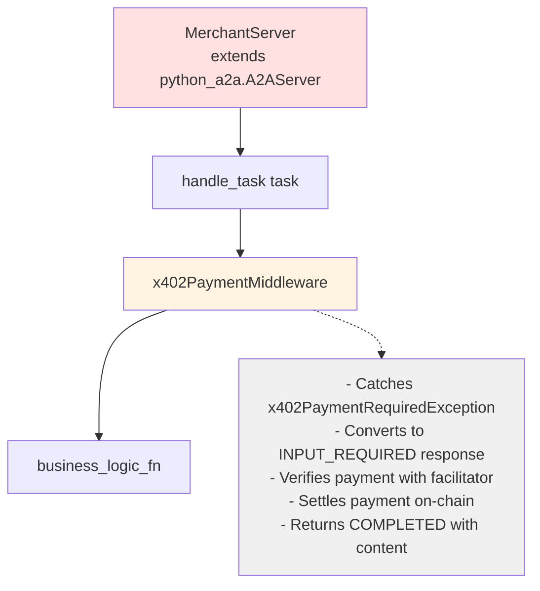
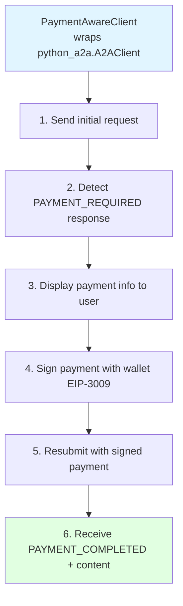

# python-a2a-x402-mvp

A spec-compliant implementation of the x402 payment protocol extension for python-a2a, enabling cryptocurrency payments in agent-to-agent commerce.

## Overview

This project implements the [x402 payment protocol specification](https://github.com/google-agentic-commerce/a2a-x402/spec/v0.1/spec.md) (~95% spec compliance) using python-a2a (by themanojdesai). It demonstrates how AI agents can autonomously negotiate and execute cryptocurrency payments using EIP-3009 transfer authorization.

### Key Components

- **MerchantServer**: Extends `python_a2a.A2AServer` with x402 payment capabilities
- **x402PaymentMiddleware**: Spec-compliant middleware handling the complete payment lifecycle
- **PaymentAwareClient**: Wraps `python_a2a.A2AClient` for autonomous payment handling
- **MockFacilitator**: Test facilitator simulating blockchain payment verification and settlement

### Spec Compliance

✅ **Implemented (100% of core spec)**:
- **HTTP header extension activation** (Spec Section 7)
  - Client sends `X-A2A-Extensions` header with extension URI
  - Server echoes header in response to confirm activation
  - Uses x402-a2a package helpers for header checking
- Metadata structure using `x402.payment.*` dotted keys
- Payment status values in kebab-case per spec
- x402Version field in responses
- Receipt array with full payment history tracking
- TaskId correlation for multi-turn payment flows
- Standardized error codes (`x402ErrorCode` enum)
- Payment expiry validation framework
- outputSchema support in PaymentRequirements

## Architecture

### Server-Side (Merchant)



### Client-Side (Buyer)



## Payment Flow

The implementation follows the x402 spec's complete payment lifecycle:

### 1. Payment Required (Spec Section 4.1)
- Client sends purchase request (e.g., "Buy a laptop")
- Server's business logic raises `x402PaymentRequiredException`
- Middleware sets `task.status.state = INPUT_REQUIRED`
- Metadata contains:
  ```json
  {
    "x402.payment.status": "payment-required",
    "x402.payment.required": {
      "x402Version": 1,
      "accepts": [{ scheme, network, asset, payTo, maxAmountRequired, ... }]
    }
  }
  ```

### 2. Payment Submitted (Spec Section 4.2)
- Client detects `payment-required` status in metadata
- Signs payment using EIP-3009 transfer authorization
- Resubmits task with same task ID (correlation)
- Metadata contains:
  ```json
  {
    "x402.payment.status": "payment-submitted",
    "x402.payment.payload": { scheme, network, signature, ... }
  }
  ```

### 3. Payment Verification (Spec Section 5.1)
- Middleware validates payment hasn't expired (`maxTimeoutSeconds`)
- Facilitator verifies signature and payment authorization
- Middleware updates status to `payment-verified`

### 4. Payment Completed (Spec Section 5.2)
- Business logic executes and generates response
- Facilitator settles payment on-chain
- Middleware appends to receipt array and sets final status:
  ```json
  {
    "x402.payment.status": "payment-completed",
    "x402.payment.receipts": [{ success, network, txHash, ... }]
  }
  ```
- Task state changes to `COMPLETED` with artifacts

### Error Handling (Spec Section 8)
On failure, middleware sets:
```json
{
  "x402.payment.status": "payment-failed",
  "x402.payment.error": "INVALID_SIGNATURE",
  "x402.payment.receipts": [{ success: false, errorReason, ... }]
}
```

See [ARCHITECTURE.md](ARCHITECTURE.md) for detailed sequence diagrams and function traces.

## Installation

```bash
# Clone repository
git clone https://github.com/ryanRfox/python-a2a-x402-mvp.git
cd python-a2a-x402-mvp

# Create virtual environment
python3 -m venv venv
source venv/bin/activate

# Install all dependencies (including x402-a2a from GitHub)
pip install -r requirements.txt
```

**Note**: The `x402-a2a` package is installed directly from GitHub as it's not available on PyPI. This is handled automatically by requirements.txt using PEP 440 direct references.

See [CONTRIBUTING.md](CONTRIBUTING.md) for detailed development setup.

## Usage

### Run Tests

```bash
# Run all tests (41/41 passing: 38 unit + 3 integration)
python -m pytest tests/ -v

# Run only unit tests (38/38 passing)
python -m pytest tests/unit/ -v

# Run only integration tests (3/3 passing)
python -m pytest tests/integration/ -v

# Run specific test file
python -m pytest tests/unit/test_wallet.py -v

# Run with detailed logging
python -m pytest tests/ -v -s
```

**Test Coverage:**
- ✅ **Unit Tests (38/38 passing)**:
  - Wallet: EIP-3009 signing (4 tests)
  - Facilitator: Verify & settle (6 tests)
  - MerchantServer: Business logic & payments (5 tests)
  - x402PaymentMiddleware: Payment lifecycle (5 tests)
  - PaymentAwareClient: Client-side flow (10 tests)
  - HTTP Headers: Extension activation (8 tests)
- ✅ **Integration Tests (3/3 passing)**:
  - Complete payment flow end-to-end
  - Free service (no payment)
  - HTTP header activation over real HTTP

See [tests/README.md](tests/README.md) for comprehensive testing documentation.

### Port Configuration

The system uses distinct ports for different environments to avoid conflicts:

| Environment | Port | Purpose | Configuration |
|-------------|------|---------|---------------|
| **Production/Demo** | `5001` | Default merchant server | `merchant_server.py` default |
| **Integration Tests** | `5555` | Test server (isolated) | `tests/fixtures/server_fixtures.py` |
| **Unit Tests** | N/A | No server runs | Tests use mocks only |

**Why separate ports?**
- Integration tests can run while demo server is running
- No port conflicts between test runs
- Clean separation of concerns

### Run Interactive Demo

**Terminal 1 - Start Merchant Server:**
```bash
# Default port (5001)
python src/merchant_server.py

# Or specify custom port
python src/merchant_server.py --port 5001
```

**Terminal 2 - Run Client:**
```bash
# Connect to default port
python src/payment_client.py --server http://localhost:5001

# Or specify custom server
python src/payment_client.py --server http://localhost:5001
```

**Terminal 3 - Run Tests (while demo runs):**
```bash
# Integration tests use port 5555 (no conflict with port 5001)
python -m pytest tests/integration/ -v
```

Then try commands like:
- "What's your status?" (free)
- "Buy a laptop" (requires payment)

## Project Structure

```
python-a2a-x402-mvp/
├── src/                           # Source code
│   ├── merchant_server.py         # MerchantServer extending A2AServer
│   ├── x402_middleware.py         # Payment middleware for python-a2a
│   ├── payment_client.py          # PaymentAwareClient wrapper
│   ├── wallet.py                  # MockLocalWallet with EIP-3009 signing
│   └── facilitator.py             # MockFacilitator for testing
├── tests/                         # Test suite
│   ├── README.md                  # Testing documentation
│   ├── conftest.py                # Global fixtures and TypeTracer
│   ├── fixtures/                  # Reusable test fixtures
│   │   ├── client_fixtures.py     # Wallet and client fixtures
│   │   └── server_fixtures.py     # Server and facilitator fixtures
│   ├── unit/                      # Unit tests (38/38 passing)
│   │   ├── test_wallet.py         # Wallet signing tests
│   │   ├── test_facilitator.py    # Facilitator tests
│   │   ├── test_merchant_server.py # Merchant server tests
│   │   ├── test_x402_middleware.py # Middleware tests
│   │   ├── test_payment_client.py  # Client tests
│   │   └── test_http_headers.py    # HTTP header activation tests
│   └── integration/               # Integration tests (3/3 passing)
│       └── test_payment_flow.py   # End-to-end payment flow over HTTP
├── _PLANNING_/                    # Design documents
│   ├── ARCHITECTURE_DECISION.md   # Why we use upstream x402-a2a
│   ├── ARCHITECTURE_ANALYSIS.md   # Initial architecture analysis
│   ├── DESIGN_PROPOSAL.md         # Original design proposal
│   ├── SPEC_COMPLIANCE_REPORT.md  # Spec compliance tracking
│   └── FUTURE_WORK.md             # Future enhancements
├── ARCHITECTURE.md                # Technical architecture documentation
├── CONTRIBUTING.md                # Development setup and workflow
├── README.md                      # This file
├── pytest.ini                     # Pytest configuration
└── requirements.txt               # Python dependencies
```

**Note**: We use the upstream [`x402-a2a` package](https://github.com/google-agentic-commerce/a2a-x402/tree/main/python) for types and constants. See [_PLANNING_/ARCHITECTURE_DECISION.md](_PLANNING_/ARCHITECTURE_DECISION.md) for rationale.

## Key Design Decisions

### 1. Middleware Pattern
The `x402PaymentMiddleware` is a separate class following the adapter pattern:
- Wraps business logic functions without modifying them
- Handles payment lifecycle orthogonally to business concerns
- Maintains spec-compliant state management
- Enables clean separation of payment and business logic

### 2. Spec-Compliant Metadata Structure
All payment state is stored in `task.status.message.metadata` using dotted keys:
- `x402.payment.status` - Current payment state (kebab-case)
- `x402.payment.required` - Payment requirements with `x402Version`
- `x402.payment.payload` - Signed payment authorization
- `x402.payment.receipts` - Array of settlement results (full history)
- `x402.payment.error` - Standardized error code on failure

Helper function `_get_metadata_dict()` handles python-a2a's `Metadata` objects.

### 3. Task Correlation
Payment submissions reuse the original task ID:
```python
payment_task = Task(
    id=task.id,  # Same ID for correlation
    status=TaskStatus(...)
)
```
This enables the server to retrieve stored payment requirements.

### 4. Receipt Array Tracking
All payment attempts (success and failure) are appended to `x402.payment.receipts`:
```python
metadata["x402.payment.receipts"].append(
    settle_response.model_dump(by_alias=True)
)
```
This provides complete payment history per spec requirement.

### 5. Exception-Driven Payment Flow
Business logic raises `x402PaymentRequiredException` when payment is needed:
```python
raise x402PaymentRequiredException(
    "Payment required for laptop",
    payment_requirements=[requirements]
)
```
Middleware catches and converts to spec-compliant INPUT_REQUIRED response.

### 6. Mock Components for Testing
- **MockLocalWallet**: EIP-3009 signing with hardcoded key ⚠️ **TESTING ONLY**
- **MockFacilitator**: Simulates verification/settlement ⚠️ **NOT PRODUCTION-READY**

## Dependencies

- **python-a2a** (>=0.5.10): Python implementation of Google's A2A protocol (by themanojdesai)
- **x402-a2a** (>=1.0.0): Upstream x402 types and constants (Google/Coinbase)
- **eth-account** (>=0.13.7): Ethereum wallet and signing
- **httpx** (>=0.28.1): HTTP client
- **pydantic** (>=2.0.0): Data validation
- **pytest** (>=8.0.0): Testing framework
- **pytest-asyncio** (>=0.23.0): Async test support

## Testing

The test suite provides comprehensive coverage of core components:

### Test Coverage

✅ **All Tests Passing: 41/41 (38 unit + 3 integration)**

**Unit Tests (38/38 passing)**:
- **Wallet** (4 tests):
  - Initialization and address validation
  - EIP-3009 payment signing
  - Amount validation
  - Network consistency

- **Facilitator** (6 tests):
  - Initialization with valid/invalid flags
  - Payment verification (success/failure)
  - Payment settlement (success/failure)

- **MerchantServer** (5 tests):
  - Initialization and agent card
  - Free vs paid service handling
  - Payment requirement generation
  - Deterministic pricing logic

- **x402PaymentMiddleware** (5 tests):
  - Initialization and state management
  - Free service pass-through
  - Payment exception catching
  - Verify and settle flow
  - x402 metadata structure compliance

- **PaymentAwareClient** (10 tests):
  - Initialization with/without wallet
  - Custom fields extraction
  - Payment requirement detection
  - Task creation and response extraction
  - Complete payment flow integration

- **HTTP Headers** (8 tests):
  - Extension URI constant validation
  - Extension activation detection
  - Client sends activation header
  - Server echoes header
  - Spec Section 7 compliance

**Integration Tests (3/3 passing)**:
- **Complete Payment Flow**: Full end-to-end payment over HTTP with auto-approve
- **Free Service Flow**: Services without payment requirements
- **HTTP Header Activation**: Real HTTP requests with X-A2A-Extensions header

### Test Infrastructure

- **TypeTracer**: Detailed function call tracing with type information
- **Fixtures**: Reusable components (wallet, server, facilitator)
- **Professional logging**: Comprehensive execution traces

### Running Tests
```bash
# Run all unit tests
python -m pytest tests/unit/ -v

# Run specific test file
python -m pytest tests/unit/test_wallet.py -v

# Run with detailed output
python -m pytest tests/ -v -s

# Expected output: 41 passed in 4.65s
```

See [tests/README.md](tests/README.md) for comprehensive testing documentation.

## Production Considerations

⚠️ **This is a demonstration/MVP (100% core spec-compliant)**

### Security Requirements for Production

**Critical**:
- Replace `MockLocalWallet` with secure key management (HSM, KMS, or secure enclave)
- Integrate real payment facilitator (not `MockFacilitator`)
- Implement timestamp tracking for payment expiry validation
- Add rate limiting and DDoS protection
- Enable comprehensive audit logging

**Recommended**:
- Add HTTP header extension activation (requires python-a2a changes)
- Implement proper authentication and authorization
- Add monitoring and alerting for payment failures
- Set up disaster recovery procedures
- Conduct security audit before production deployment

### Missing Production Features

- Production-grade expiry validation with timestamp tracking
- Real facilitator integration (Coinbase Commerce, Stripe Crypto)
- Enhanced testing (unit tests, negative cases, load testing)
- Performance optimizations (async operations, caching, Redis)
- Security enhancements (rate limiting, audit logging)

## License

Apache 2.0

## Documentation

- **[README.md](README.md)** - This file: project overview and quick start
- **[ARCHITECTURE.md](ARCHITECTURE.md)** - Complete technical documentation:
  - System component diagrams
  - Payment flow sequence diagrams
  - Metadata structure visualization
  - State machine diagrams
  - Function call traces with example data
  - Error handling flowcharts
- **[CONTRIBUTING.md](CONTRIBUTING.md)** - Development setup and workflow
- **[tests/README.md](tests/README.md)** - Testing guide and best practices
- **[_PLANNING_/](_PLANNING_/)** - Design decisions and planning documents:
  - [ARCHITECTURE_DECISION.md](_PLANNING_/ARCHITECTURE_DECISION.md) - Why we use upstream x402-a2a
  - [SPEC_COMPLIANCE_REPORT.md](_PLANNING_/SPEC_COMPLIANCE_REPORT.md) - Spec compliance tracking
  - [FUTURE_WORK.md](_PLANNING_/FUTURE_WORK.md) - Planned enhancements

## References

### Specifications
- [x402 A2A Extension](https://github.com/google-agentic-commerce/a2a-x402) - Official x402 repository
- [x402 Protocol Specification v0.1](https://github.com/google-agentic-commerce/a2a-x402/spec/v0.1/spec.md) - Official spec
- [x402 Protocol Documentation](https://x402.gitbook.io/x402) - Protocol overview
- [EIP-3009: Transfer With Authorization](https://eips.ethereum.org/EIPS/eip-3009) - Ethereum payment standard

### Frameworks
- [python-a2a](https://github.com/themanojdesai/python-a2a) - Python implementation of Google's A2A protocol (by themanojdesai)
- [x402-a2a](https://github.com/google-agentic-commerce/a2a-x402/tree/main/python) - Official x402 Python package (Google/Coinbase)
